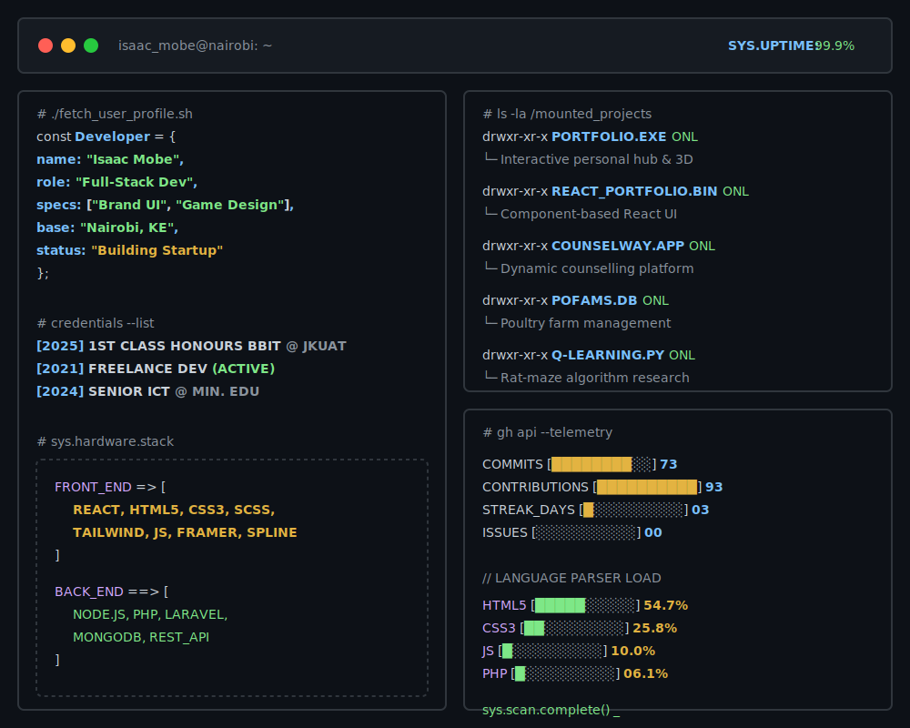

  

 

### `> INTERACTIVE_COMMS_LINKS`

<kbd><a href="https://isaacmobe.framer.website/"> 🌐 PORTFOLIO_HUB </a></kbd> &nbsp;
<kbd><a href="https://www.linkedin.com/in/isaac-mobe/"> 💼 LINKEDIN_AUTH </a></kbd> &nbsp;
<kbd><a href="mailto:isaacmongechi@gmail.com"> 📧 SECURE_EMAIL </a></kbd> &nbsp;
<kbd><a href="https://www.artstation.com/isaacmobe"> 🎨 ARTSTATION_LOG </a></kbd> &nbsp;
<kbd><a href="https://twitter.com/isaac_mobe"> 🐦 X_TWITTER </a></kbd> &nbsp;
<kbd><a href="https://cal.com/isaac-mobe/30min"> 📅 SCHEDULE_CAL </a></kbd>

 

### `> EXECUTABLE_DIRECTORIES`

| COMMAND | FILE NAME | DESCRIPTION | STACK |
| :--- | :--- | :--- | :--- |
| <kbd><a href="https://isaacmobe.framer.website/">EXECUTE</a></kbd> | `PORTFOLIO.EXE` | Interactive personal hub & 3D art | `FRAMER` `SPLINE` `HTML` |
| <kbd><a href="https://github.com/isaacmobe/React_Portfolio">EXECUTE</a></kbd> | `REACT_PORTFOLIO.BIN` | Component-based React UI | `REACT` `JS` |
| <kbd><a href="https://github.com/isaacmobe/3D-PORTFOLIO">EXECUTE</a></kbd> | `3D-PORTFOLIO.SYS` | React, Tailwind, Three.js build | `REACT` `TAILWIND` |
| <kbd><a href="https://github.com/isaacmobe/CounselWay">EXECUTE</a></kbd> | `COUNSELWAY.APP` | Dynamic counselling platform | `HTML` `CSS` `JS` |
| <kbd><a href="https://github.com/isaacmobe/pofams">EXECUTE</a></kbd> | `POFAMS.DB` | Poultry farm management | `PHP` `LARAVEL` |
| <kbd><a href="https://github.com/isaacmobe/Q-LEARNING">EXECUTE</a></kbd> | `Q-LEARNING.PY` | Rat-maze algorithm research | `PYTHON` |
| <kbd><a href="https://github.com/isaacmobe/ecom-in-laravel">EXECUTE</a></kbd> | `ECOM-LARAVEL.APP` | Full E-commerce web application | `PHP` `LARAVEL` |

 

### `> LIVE_TELEMETRY_FEEDS`

  
    

  
  

   

  

