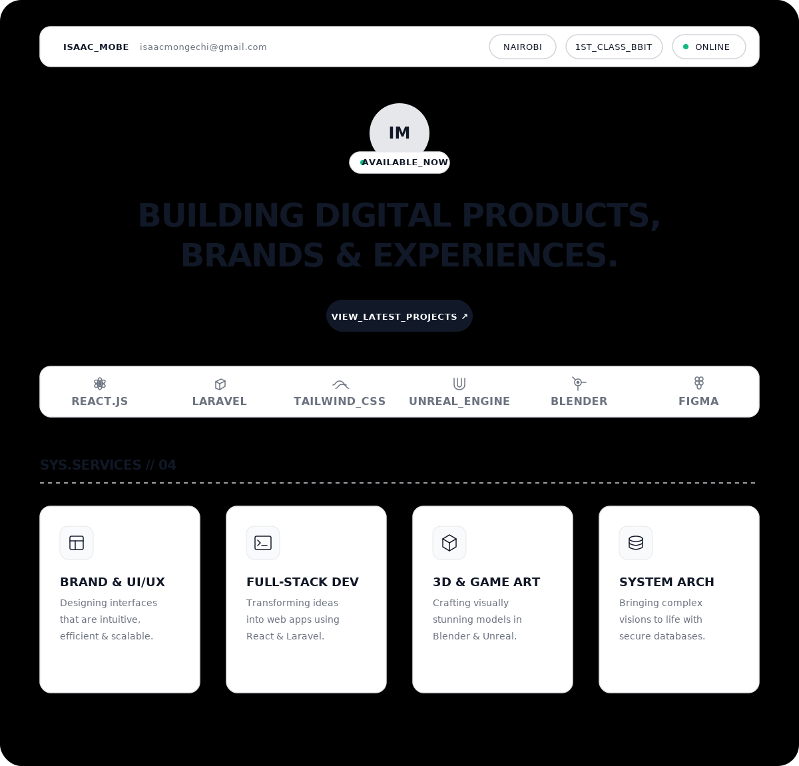

  

 

  <code>[ ANALYTICS_TRACKER // PROFILE_VIEWS ]</code> 
  

 

### <code>SYS.EXECUTE // NEXT_PROJECT</code>

 

<code><a href="https://www.linkedin.com/in/isaac-mobe/">LINKEDIN</a></code> &nbsp;·&nbsp; <code><a href="https://www.artstation.com/isaacmobe">ARTSTATION</a></code> &nbsp;·&nbsp; <code><a href="https://dribbble.com/isaacmobe">DRIBBBLE</a></code> &nbsp;·&nbsp; <code><a href="https://twitter.com/isaac_mobe">X_TWITTER</a></code>

 
 

<code>[ GITHUB_DATA_LOG // LIVE_ANALYTICS ]</code>

 

 

